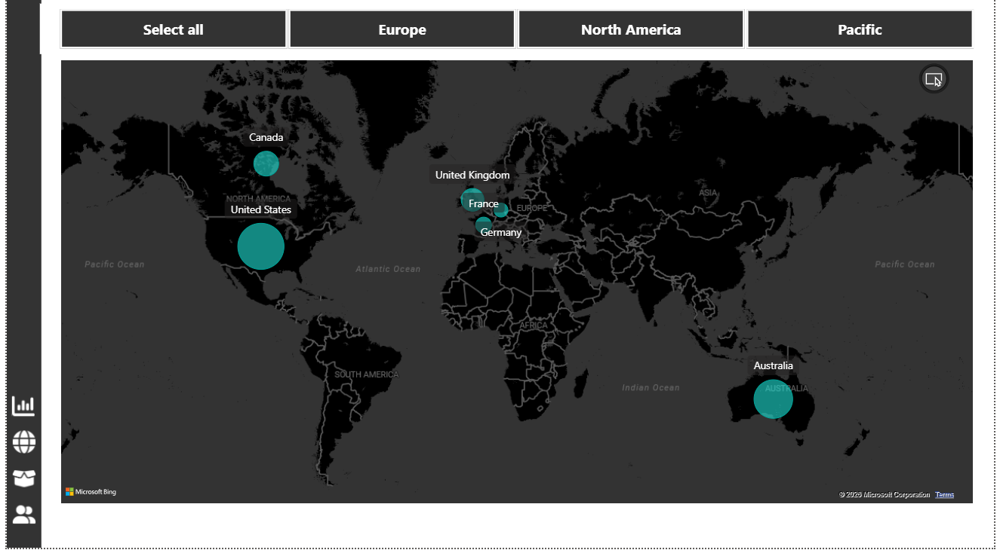
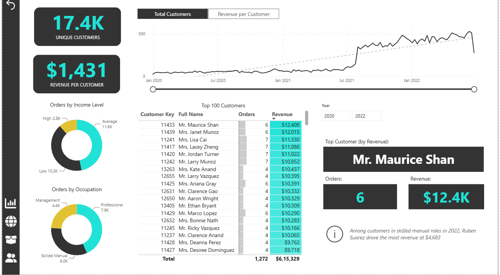

## 💡 Advanced Power BI Features

### 💬 Category Tooltip
Created a custom **Category Tooltip** to display additional insights when users interact with category-level visuals.

### 🎛️ Dynamic Metric Selection
Users can dynamically switch between key metrics:

- Orders
- Revenue
- Profit
- Returns
- Return %

### 🗺️ Interactive Map
An interactive map was used to analyze geographical sales and customer performance across different regions.

### 🎯 Target Analysis
Product performance was analyzed against targets for:

- Orders
- Revenue
- Profit

### 🔖 Bookmarks & Navigation
Used **Bookmarks and Page Navigation** to connect all dashboard pages and create a smooth interactive user experience.

---

## 🛠️ Tools & Technologies

- **Microsoft Power BI**
- **Power Query**
- **DAX**
- **Data Modeling**
- **Time Intelligence**
- **Data Visualization**
- **Interactive Maps**
- **Bookmarks**
- **Custom Tooltips**
- **Dynamic Metrics**

---

## 📊 Key Features

- Interactive KPI cards
- Sales, revenue & profit analysis
- Return rate analysis
- Product & customer analysis
- Geographic analysis
- Monthly trend analysis
- Top product & customer analysis
- Orders, Revenue & Profit vs Target
- Dynamic metric selection
- Interactive map visualization
- Custom category tooltip
- Bookmark-based navigation
- Cross-page navigation
- Interactive filters & slicers

---

## 📸 Dashboard Screenshots

### 🔹 Executive Dashboard


Provides a consolidated view of **revenue, profit, orders, returns, products, and monthly trends**.

---

### 🔹 Map Analysis



Provides **geographical analysis** of sales and customer performance across different regions.

---

### 🔹 Product Details


Provides detailed **product performance, orders, revenue, profit, targets, and price adjustment analysis**.

---

### 🔹 Category Tooltip


Displays additional **category-level insights** through a customized tooltip.

---

### 🔹 Customer Details



Provides **customer-level analysis**, including customers, revenue per customer, orders, income level, occupation, and top customers.

---

## 🔄 Project Workflow

```text
Adventure Works Dataset
        ↓
Data Cleaning & Transformation
        ↓
Data Modeling
        ↓
DAX Measures
        ↓
Time Intelligence
        ↓
Interactive Visualizations
        ↓
Advanced Power BI Features
        ↓
Dashboard Development
        ↓
Business Insights


## 🎯 Skills Demonstrated

- Power BI Dashboard Development
- Power Query & Data Transformation
- DAX & Measure Creation
- Data Modeling
- Time Intelligence
- KPI Development
- Interactive Data Visualization
- Sales & Revenue Analysis
- Profit & Return Analysis
- Product Performance Analysis
- Customer Analysis
- Geographic Analysis
- Interactive Map Visualization
- Dynamic Metric Selection
- Target vs Actual Analysis
- Bookmarks & Page Navigation
- Custom Tooltips
- Interactive Filters & Slicers
- Business Intelligence & Reporting
